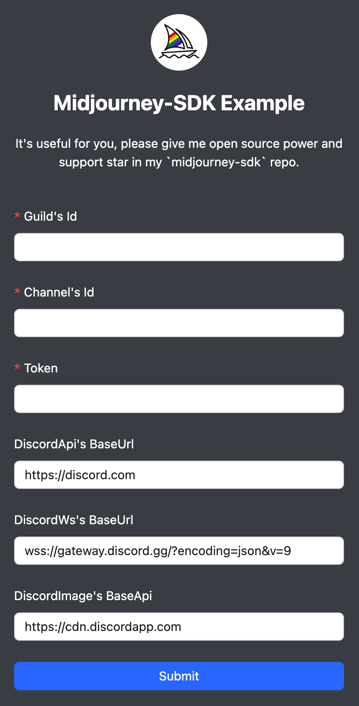
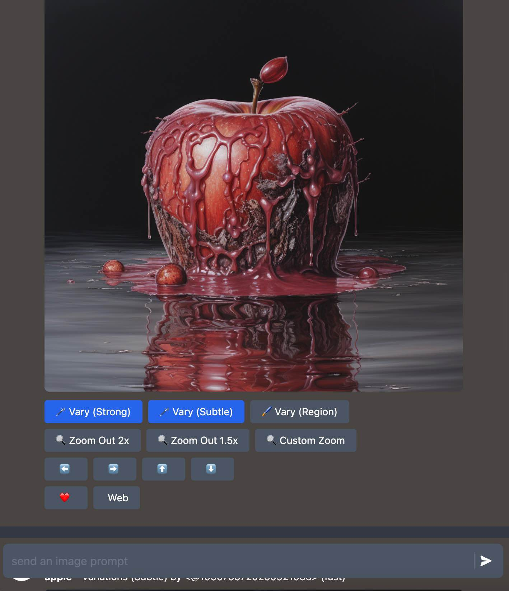
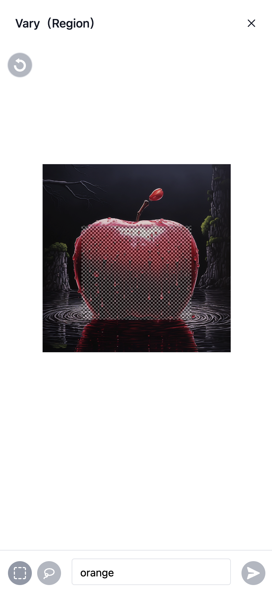
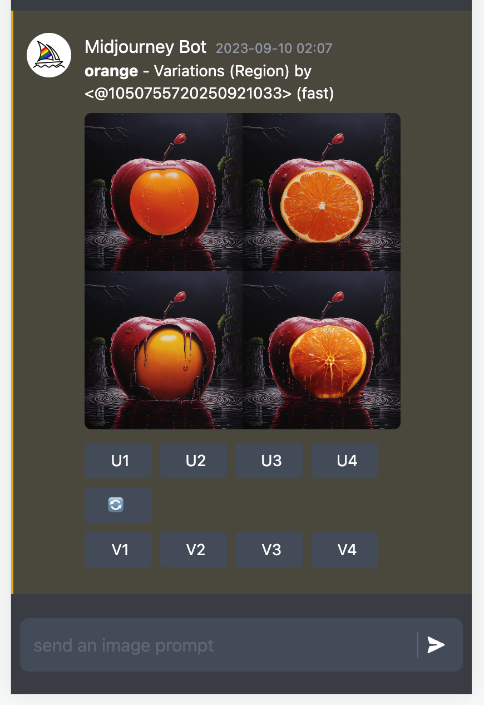
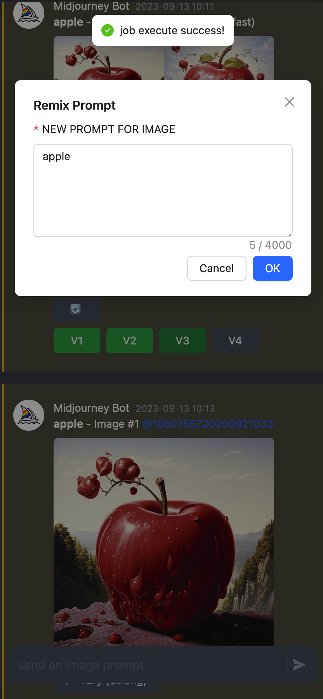

# MidJourney-SDK <a href="https://www.npmjs.com/package/midjourney-sdk"></a>

MidJourney in Discord API for Node.js.

## Demo

[Live demo](https://midjourney-sdk-playground-next.vercel.app)







## Support

- Command
  - [x] `/imagine`
  - [x] `/info`
  - [x] `/settings`
  - [x] `/fast`
  - [x] `/relax`
- Button Action
  - [x] `upscale`
  - [x] `variation`
  - [x] `reroll`
  - [x] `zoomout`
  - [x] `vary(Region)`
- Remix Mode

## Install

```bash
pnpm i midjourney-sdk
```

## Usage

```typescript
import { MidJourney } from 'midjourney-sdk'
const ins = new MidJourney({
  token: process.env.NEXT_PUBLIC_TOKEN,
  guild_id: process.env.NEXT_PUBLIC_GUILD_ID,
  channel_id: process.env.NEXT_PUBLIC_CHANNEL_ID,
  skipHeartbeat: true
})
;(async () => {
  await ins.init()
  // trigger image job
  const msg1 = await ins.api.imagine('apple --q 5', ({ url, progress }) => {
    console(url, progress)
  })
  // trigger button job
  const msg2 = await ins.api.action(
    'msgId',
    'customId',
    'msgFlags',
    ({ url, progress }) => {
      console(url, progress)
    }
  )
  // trigger remix job
  const msg3 = await ins.api.remixSubmit(
    'modalMsgId',
    'customId',
    'components',
    ({ url, progress }) => {
      console(url, progress)
    }
  )
  // trigger vary(region) job
  const msg4 = await ins.api.varyRegion(
    'customId',
    'prompt',
    'mask',
    ({ url, progress }) => {
      console(url, progress)
    }
  )
})()
```

## Development

- edit environment `.env` file

```
# playground/.env
NEXT_PUBLIC_TOKEN=
NEXT_PUBLIC_GUILD_ID=
NEXT_PUBLIC_CHANNEL_ID=
# discord api proxy url
NEXT_PUBLIC_API_BASE_URL=
# discord websocket proxy url
NEXT_PUBLIC_IMG_BASE_URL=
# discord websocket proxy url
NEXT_PUBLIC_WS_BASE_URL=
```

- run `play` script

```bash
pnpm play
```

- open `http://localhost:3000`

## License

[MIT](./LICENSE) License © 2023-PRESENT [BaoBao](https://github.com/bao-io)
